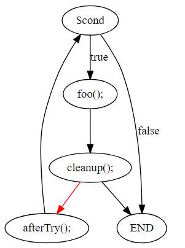

# SonarPHP Control Flow Graph

## Definition

A CFG is a graph of [basic blocks](https://en.wikipedia.org/wiki/Basic_block) (from now on, we will use the term 'block'), where a block is a sequence of statements executed linearly without branching.

### Blocks

#### Block attributes

- *successors* - set of blocks executed after specific block. Each block has one or more successors. The only exception is the special `END` block, representing the end of the control flow, which has zero successors.
- *predecessors* - set of blocks executed before a specific block.
- *syntactic successor*
  - an imaginary successor which exists only for blocks ending with unconditional jumps (`break`, `continue`, `return`, `goto`, `throw`).
  - it is the "normal" successor in case the jump would be omitted.
  - for non-jump blocks, it is `null`.
- *elements*
  - list of statements (represented as AST node) inside the block executed sequentially.
  - `return` or jump like `break`, `continue` will be the last statement in the elements list  (if such statement is present in the block).

##### Branching block

`if`, `while`, `for`,  `foreach`  and `do-while` statements generate a special type of the block called Branching Block. It has all the attributes of a normal block; however, it has exactly two successors representing *true* and *false* branch of execution, and it has an additional attribute *branching tree* which contains the statement causing the branching (e.g., AST node of `if` condition).

### Statements

Statements that generate blocks:

- `try`,  `throw`,  `return`, `break`,  `continue`,  `goto`,  `label`, `do-while`, `while`, `for`,  `foreach`, `if`, `switch`

Every other statement is added as an element to the containing block (including ternary expressions).

In other words, we do not explore the expressions inside the above statements when building the CFG, we add them to the list of elements.

## Implementation

The CFG is built bottom-up: we start with an empty END block (bottom), which represents the end of the control flow in the current function and recursively process the predecessor statements in the block. The algorithm is implemented as an AST visitor in [ControlFlowGraphBuilder](../php-frontend/src/main/java/org/sonar/php/cfg/ControlFlowGraphBuilder.java).

A CFG is generated for the following trees: SCRIPT, FUNCTION_DECLARATION, FUNCTION_EXPRESSION, METHOD_DECLARATION.

### For Loop

The `for` statement creates multiple blocks:

- one for initialization of variables (before body).
- one for the body of the `for` statement.
- one for update (following the body).
- one for the condition.

### Switch

The SWITCH statement is modeled as multiple `if-elseif-else` blocks. An interesting feature of the `switch` statement in PHP is that a `continue` inside switch behaves as a `break` statement ([see manual](http://php.net/manual/en/control-structures.continue.php)).

### Try Catch Finally

We made several assumptions to simplify the construction of CFG for `try-catch-finally` statement:

- `try` body generates a single block where `catch` and `finally` are successors of this block. Note however that every statement in the body could raise an exception and exit the block. It is up to the analysis using the CFG to take into consideration that the body may not be executed as a whole.
- If the `finally` clause is missing, we assume that an empty `finally` clause is present to simplify the construction of CFG. 
- We always assume that it is possible that any present `catch` clause does not handle an exception, even if there is `catch` clause handling all `Exception` types. In particular, this means that there is always a path to the `END` block (visiting all enclosed `finally` blocks on the way).

### Limitations

#### Empty blocks

During the construction of the CFG some empty blocks might be created (e.g., empty `finally` clause, ...). We have a mechanism to clean up these empty blocks; however, it can only remove empty blocks with one predecessor and one successor. If an empty block has multiple successors (which often happens with `try-catch-finally` statements), it is not removed. Consequently, if such empty block has successors which are dead code, they will not be detected, because for the algorithm they appear to be reachable (they have a predecessor).

#### Unfeasible paths from `finally`

Because we are building the CFG using a bottom-up approach, we will construct the `finally` block before we construct the block for the `try` body. This `finally` block will have two successors:

1. "*exceptional*" successor representing the path for the unhandled exception connecting it to the outer `finally` clause or  `END` block.
2. "*normal*" successor to the statement following the `try` statement.

This "*normal*" successor can be unreachable in the case when there is an abrupt termination of the control flow in `try` body like `return` or `break`. Consider the following example:

```php
while ($cond) {
    try {
        foo();
        break;
    } finally {
        cleanup();
    }
    afterTry();
}
```


Our CFG will look like this:




Notice that the red edge is impossible, but it will be present in the CFG due to this limitation. The consequence of this is a failure to detect that `afterTry` is dead code.

## Tests

The best documentation is Test Automation, see [ControlFlowGraphTest](../php-frontend/src/test/java/org/sonar/php/cfg/ControlFlowGraphTest.java).